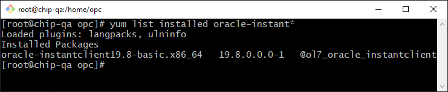
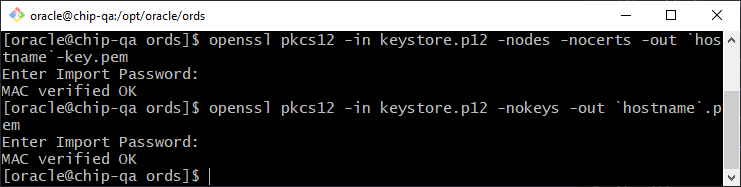
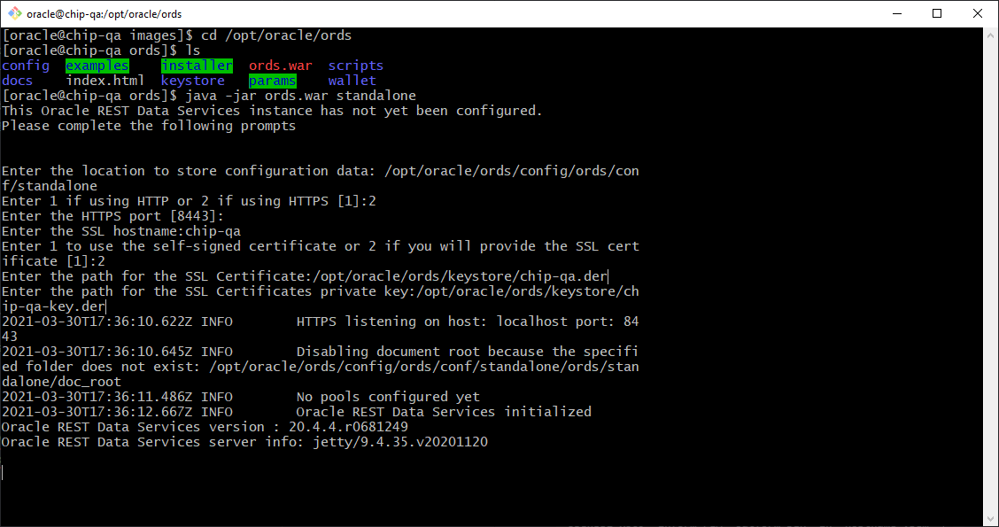

# Installing ORDS in a Custom Compute VM
This markdown contains documentation of the steps to config OEL 7 with ORDS to connect to a backend ATP instance. The documentation assumes basic knowledge of OCI and focus's on the details of the installation and some steps not in the current documentation.

## Create a VCN

- Sign in and open up to the console


- Click on the hamburger menu, navigate to Networking and click on Virtual Cloud Networks


- Click on Start VCN Wizard


- Select VCN with Internet Connectivity and click Start VCN Wizard


- Give your network a name, leave the configuration as default and click next at the bottom


- Review the configuration and click Create


- On your newly created VCN page, scroll down and click on Security Lists


- Select the Default Security List


- Click Add Ingress Rules


- Add port 8443 to the security list


- Add another Ingress Rule


- Add port 433 to the security list


## Create a Compute VM

- Click on the hamburger menu, navigate to Compute and select Instances


- Click Create Instance


- Give the instance a name, select the Availability domain, and select the shape Oracle Linux 7.9 virtual Machine


- Select the network we just created along with its subnet


- You can choose to generate a key pair or upload your own public key


- Scroll down and click create


## Configure the Load Balancer

- Click the hamburger menu, scroll to Networking and select Load Balancers


- Click Create Load Balancer


- Select Load Balancer and click Create Load Balancer


- Give the Load Balancer a name, select Public, and Reserved IP Address. Click Create new IP address and give the Public IP a name. Select the compartment you would like the Load Balancer to live.


- Select Dynamic shape, the amount of traffic you anticipate for your application will dictate the size of bandwidth shape for your load balancer. Also slesct the VCN and Subnet you created in previous steps. Click Next.


- Select Weighted Round Robin and click on Add More Backends


- Select the compute instance you created earlier


- Specify protocol TCP and port 8443 and click Next


- Select TCP and specify port 443 and click Submit at the bottom of the page


Click into the newly created Load Balancer page. Scroll down, and on the left hand side, select Backend Sets


- Click into the Backend Set


- Click into Backends


- Select the IP Address, click actions and choose Edit


- Enter 8443 for the Port and click save changes


## Connect to the VM
- Get the public IP of your VM - 129.146.108.227
Test Env. - 129.146.178.47
QA Env - 129.146.108.227


- From local machine SSH in with key
```
cd oci_developer_key/
ssh -i chipdev opc@129.146.108.227
```

## Check and install latest insta client
```
sudo su
# if prompted to download press y for yes
yum update
yum install oracle-release-el7
yum-config-manager --enable ol7_oci_included
```
- Locate all instaclient versions
```
 yum list installed oracle-instant*
```


- If older version installed remove
```
 yum remove oracle-instantclient18.3-basic.x86_64
```

- Else add newer version
```
# if prompted to download press y for yes
yum install oracle-instantclient19.8-basic.x86_64
```

- Install Java, sqlcl, ords
```
# if prompted to download press y for yes
yum install java
yum install sqlcl -y
yum install -y ords
```

## Modify Linux Firewall - Pick 1
- Option 1: Only Modify port number
```
firewall-cmd --permanent --zone=public --add-port=8443/tcp
firewall-cmd --reload
```


- Option 2: Disable firewall
```
sudo systemctl stop firewalld
sudo systemctl disable  firewalld
```

## Download the ATP wallet and upload to your machine.
- Download your wallet from your ATP install. Click on DB Connections then download instance wallet.


- Open a new terminal on your local machine and Push the wallet into the opc user on your machine.
```
scp -i chipdev Wallet_SluggersAPEX.zip opc@129.146.108.227:/home/opc
```


- Go back into your ssh session to the compute VM. Unzip the wallet into the sqlcl install for using.
```
exit
whoami
# You should be user opc
# When prompted to overwrite files please select A for All
sudo unzip Wallet_SluggersAPEX.zip -d /usr/lib/oracle/19.8/client64/lib/network/admin
```


## Create Symbolic Link to Instantclient
```
#This needs to be done as user root
sudo su
whoami
# You should be root
ln -s /opt/sqlcl/bin/sql /usr/lib/oracle/19.8/client64/bin/sql
```

## Add exports to bash_profile
- Connect as user oracle
```
su - oracle
whoami
```


- Modify the bash profile
```
vi .bash_profile
# Make sure your path looks like
PATH=$PATH:$HOME/.local/bin:$HOME/bin:/usr/lib/oracle/19.8/client64/bin
#then add the exports below
export PATH
export LD_LIBRARY_PATH=/usr/lib/oracle/19.8/client64/lib
export TNS_ADMIN=/usr/lib/oracle/19.8/client64/lib/network/admin
```
- Re-source your bash_profile and check the TNS_ADMIN
```
. .bash_profile
echo $TNS_ADMIN
```


## Test Connection to ATP as user oracle
```
sql admin@SluggersAPEX_high
```

## Run the db commands
- execute in sqlcl
```
CREATE USER "ORDS_PUBLIC_USER2" IDENTIFIED BY "(Labonte47!)";
GRANT "CONNECT" TO "ORDS_PUBLIC_USER2";
BEGIN
     ORDS_ADMIN.PROVISION_RUNTIME_ROLE(
         p_user => 'ORDS_PUBLIC_USER2',
         p_proxy_enabled_schemas => TRUE);
END;
/
exit
```

- Copy Wallet to user Oracle as root and modify privs
```
#exit user oracle to become root
exit
cp /home/opc/Wallet_SluggersAPEX.zip /home/oracle
chown oracle:oinstall /home/oracle/Wallet_SluggersAPEX.zip
#return to user oracle
su - oracle
```

- Base64 the Wallet

```
# do this as user oracle
mkdir /opt/oracle/ords/wallet
base64 -w 0 Wallet_SluggersAPEX.zip > Wallet_SluggersAPEX.zip.b64
cp Wallet_SluggersAPEX.zip.b64 /opt/oracle/ords/wallet/Wallet_SluggersAPEX.zip.b64
```


- Add entry and resource bash_profile
```
vi .bash_profile
# Add the following export
export WALLET_BASE64=`cat /opt/oracle/ords/wallet/Wallet_SluggersAPEX.zip.b64`
. .bash_profile
echo $WALLET_BASE64
```


## Create the neccesary ORDS folders and files user (Oracle)
- Create the following directories
```
mkdir /opt/oracle/ords/config
mkdir /opt/oracle/ords/config/ords/
mkdir /opt/oracle/ords/config/ords/conf/
mkdir /opt/oracle/ords/config/ords/standalone
mkdir /opt/oracle/ords/config/ords/standalone/doc_root
mkdir /opt/oracle/ords/config/ords/standalone/doc_root/i
mkdir /opt/oracle/ords/config/ords/standalone/doc_root/i/20.2.0.00.20/
```

## Create the apex_pu.xml
- Execute the following code after modifing your pwd and connection, use ! infront of pwd to encrypt
```
cat << EOF > /opt/oracle/ords/config/ords/conf/apex_pu.xml
<?xml version="1.0" encoding="UTF-8" standalone="no"?>
<!DOCTYPE properties SYSTEM "http://java.sun.com/dtd/properties.dtd">
<properties>
  <entry key="db.username">ORDS_PUBLIC_USER2</entry>
  <entry key="db.password">!(Labonte47!)</entry>
  <entry key="db.wallet.zip.service">SluggersAPEX_high</entry>
  <entry key="db.wallet.zip"><![CDATA[$WALLET_BASE64]]></entry>
</properties>
EOF
```

## Create defaults.xml
- Execute the following code to create defaults.xml
```
cat << EOF > /opt/oracle/ords/config/ords/defaults.xml
<?xml version="1.0" encoding="UTF-8" standalone="no"?>
<!DOCTYPE properties SYSTEM "http://java.sun.com/dtd/properties.dtd">
<properties>
  <entry key="plsql.gateway.enabled">true</entry>
  <entry key="jdbc.InitialLimit">10</entry>
  <entry key="jdbc.MaxLimit">20</entry>
</properties>
EOF
```


## Download APEX to your local machine, download patchset to local and push up to host

- Download the latest version of APEX from web, [https://www.oracle.com/tools/downloads/apex-downloads.html](https://www.oracle.com/tools/downloads/apex-downloads.html) then from your local machine run
```
 scp -i chipdev apex_20.2_en.zip opc@129.146.108.227:/home/opc
```

- Login to oracle APEX and Lookup the APEX Patch set currently running on atp from the SQL Workshop in SQL Commands
```
select 'APEX' as product, version_no, api_compatibility, case when patch_applied = 'APPLIED' then (select listagg('Patch ' || to_char(patch_number) || ' (' || patch_version || ') installed on ' || installed_on, ', ') within group (order by installed_on) as patches from apex_patches) end as applied_patches from apex_release union all select 'ORDS' as product, ords.installed_version as version_no, null as api_compatibility, null as applied_patches from dual;
```


- Download Patchset from  https://support.oracle.com/. Do this by searching on the last patch number in the query results.


- Click in into the Patchset


- download


- We are using Patch 32006852, upload to compute vm
```
scp -i chipdev p32006852_2020_Generic.zip opc@129.146.108.227:/home/opc
```

- Extract the files to user oracle, these steps are executed as user opc then oracle.
```
exit
exit
whoami
# You should be user OPC
cd /home/opc
sudo chown oracle:oinstall apex_20.2_en.zip p32006852_2020_Generic.zip
sudo mv apex_20.2_en.zip p32006852_2020_Generic.zip /home/oracle
sudo su
su - oracle
unzip apex_20.2_en.zip -d /opt/oracle
unzip p32006852_2020_Generic.zip -d /opt/oracle/apex
cd /opt/oracle/apex/images/
cp -rf * /opt/oracle/ords/config/ords/standalone/doc_root/i/20.2.0.00.20/
```

## Now we need to create the necessary certs for ssl, continue as user opc
- create directory
```
# execute commands as user oracle
cd /opt/oracle/ords
mkdir keystore
cd keystore
```

- create keystore.jks cert
```
# execute commands as user oracle
$JAVA_HOME/bin/keytool -genkey -keyalg RSA -alias selfsigned -keystore keystore.jks -dname "CN=chip-test, OU=CX, O=Oracle, L=Ashburn, ST=Virginia, C=US" -storepass password1 -validity 3600 -keysize 2048 -keypass password1
```


- Create a PKCS12 keystore from the JKS keystore.
```
# execute commands as user oracle
$JAVA_HOME/bin/keytool -importkeystore -srckeystore keystore.jks -srcalias selfsigned -srcstorepass password1 -destkeystore keystore.p12 -deststoretype PKCS12 -deststorepass password1 -destkeypass password1
```


- Extract the key and certificate in PEM format.
```
# execute commands as user oracle
openssl pkcs12 -in keystore.p12 -nodes -nocerts -out `hostname`-key.pem
openssl pkcs12 -in keystore.p12 -nokeys -out `hostname`.pem
```


- Convert them to DER format.
```
# execute commands as user oracle
openssl pkcs8 -topk8 -inform PEM -outform DER -in `hostname`-key.pem -out `hostname`-key.der -nocrypt
openssl x509 -inform PEM -outform DER -in `hostname`.pem -out `hostname`.der
```


- you should see these files at the end, file names may change.


## add index.html to test doc_root

- test the document root directory by executing the following code.

```
cat << EOF > /opt/oracle/ords/config/ords/standalone/doc_root/index.html
<html>
<body>
ORDS APEX is running.
</body>
</html>
EOF
```

## Start Standalone ORDS
- get your hostname then start ords
```
# execute commands as user oracle
hostname
cd /opt/oracle/ords
java -jar ords.war configdir /opt/oracle/ords/config
java -jar ords.war standalone
```
- during the props enter the following.
```
HTTPS - 2
PORT - 8443
hostname - chip-qa
provide a self-signed cert - 2
enter cert location - /opt/oracle/ords/keystore/chip-qa.der
enter key location - /opt/oracle/ords/keystore/chip-qa-key.der
```


## Set ORDS to auto start - Must be root
```
# make sure you are root user
exit

# run ORDS service and enable with startup
systemctl start ords
systemctl enable ords
```


## Got to the website and test
- When you first hit the website you may get a security violation. Simply accept it.


- then Accept and continue


- go to url [https://129.146.108.227:8443/ords](https://129.146.108.227:8443/ords)

- You should see.


- If it does not appear then try to hit the index.html file by going to [https://129.146.108.227:8443](https://129.146.108.227:8443)


- You can also use the get the IP address of your Load Balancer and go to (https://132.226.127.13/ords)


## Other usefull commands to remember
```
lsof -i:8443
netstat -autnp
iptables -nvL
tcpdump -nni ens3 port 8443
```
